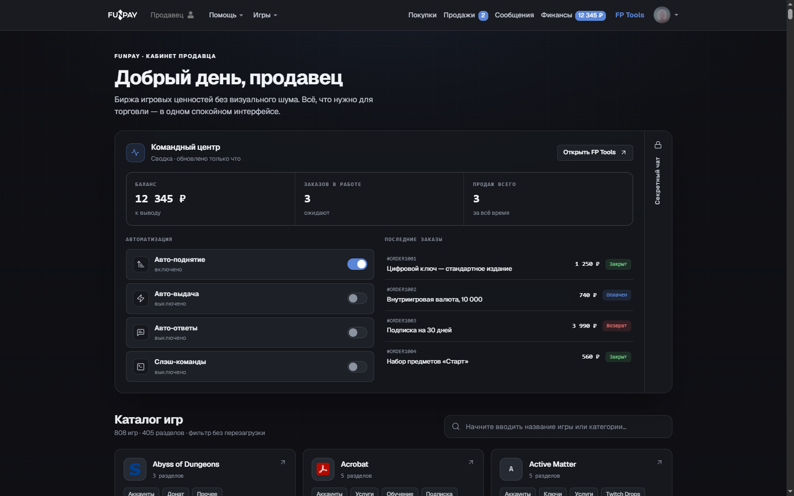
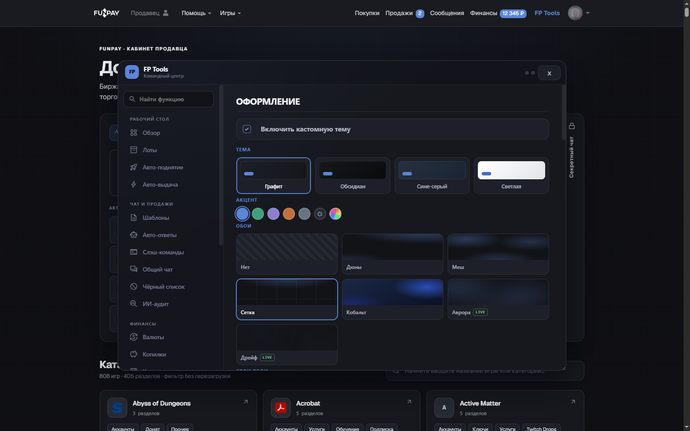
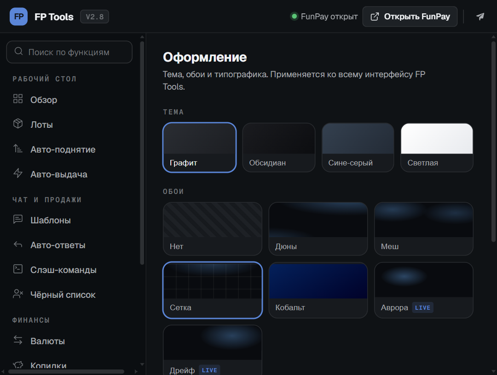

# FunPay Tools

Браузерное расширение для продавцов FunPay: аналитика продаж, автоматизация рутины, массовые операции с лотами и единый строгий интерфейс в графитовой гамме.

Это форк проекта [XaviersDev/FunPay-Tools](https://github.com/XaviersDev/FunPay-Tools) (автор оригинала — XaviersDev) с полностью переработанным дизайном и доработанной логикой: графитовая тема с единым акцентным цветом, мгновенное применение оформления без вспышек, честная статистика продаж, новая панель массовых действий с лотами.

## Возможности

### Аналитика продаж

- Статистика по всем заказам: выручка по валютам, средний чек, статусы (закрыт, в ожидании, возврат), уникальные покупатели.
- Пять режимов отображения: карточки, графики выручки и заказов по дням, круговые диаграммы по категориям, статусам и валютам, топы покупателей и товаров, полный отчёт.
- Периоды от «сегодня» до «всё время», поиск по заказам, фильтры по статусу и сортировка; клик по любой цифре открывает список конкретных заказов.
- Статусы заказов синхронизируются с сервером — возвраты и закрытия учитываются корректно.

### Автоматизация

- Авто-поднятие лотов: расширение читает ответ сервера и ставит таймер с точностью до секунды, есть фильтр по категориям и наличию авто-выдачи.
- Автоответчик: приветствие новым покупателям, ответы на оплату и подтверждение заказа, ответы на отзывы по шаблонам для каждой оценки, переменные и изображения в шаблонах.
- Авто-выдача товаров: лоты группируются по категориям, виден остаток; пустой лот отключается сам и включается обратно после пополнения.
- Уведомления в Telegram и Discord, настраиваемые звуки уведомлений и собственная мелодия.

### Работа с лотами

- Командный центр на главной странице: сводка, последние заказы со статусами, быстрые переключатели автоматизации.
- Массовые действия: выделение лотов (в том числе диапазоном через Shift), изменение цен, закрепление, дублирование, отключение, удаление.
- Экспорт и импорт лотов одним файлом, клонирование в другие категории, поиск по лотам, редактирование цены прямо на странице.
- Уникальные шрифты и символы для оформления описаний.

### Чат

- Отправка нескольких изображений с подписью одним сообщением, встроенный фоторедактор, альбомы и полноэкранная галерея.
- Поиск по открытому диалогу, черновики, шаблоны и слэш-команды, история покупок собеседника.
- ИИ-помощник: приведение черновика к вежливому виду, генерация ответов на отзывы, перевод входящих сообщений.

### Интерфейс

- Четыре темы — графит, обсидиан, сине-серый и светлая — плюс обои и пользовательский акцентный цвет.
- Тема применяется мгновенно при загрузке страницы: без вспышек, перестроений и сдвигов раскладки.
- Панель инструментов на сайте и попап расширения выполнены в едином стиле.

| Настройки оформления | Попап расширения |
| :---: | :---: |
|  |  |

## Установка

1. Скачайте архив расширения со страницы [последнего релиза](https://github.com/Kevanko/FunPay-Tools/releases/latest) и распакуйте его.
2. Откройте `chrome://extensions` и включите **Режим разработчика** (переключатель в правом верхнем углу).
3. Нажмите **Загрузить распакованное расширение** и укажите распакованную папку (в ней лежит `manifest.json`).
4. Откройте [funpay.com](https://funpay.com/) — в шапке сайта появится кнопка **FP Tools**.

Работает в Chrome и других браузерах на Chromium (Edge, Opera, Яндекс Браузер).

## Лицензия

MIT — см. [LICENSE](LICENSE). Основано на проекте [FunPay Tools](https://github.com/XaviersDev/FunPay-Tools) автора XaviersDev.
